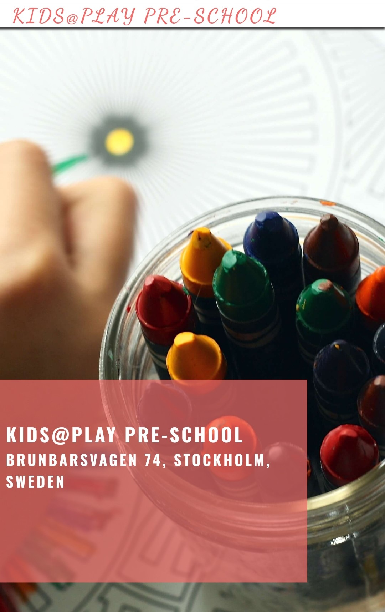
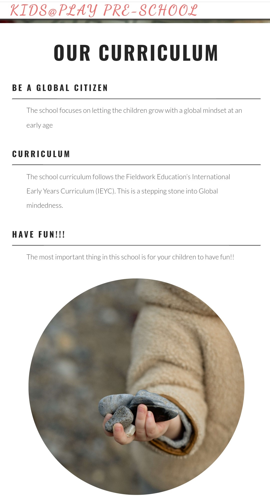
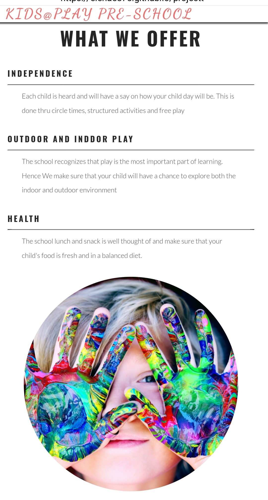
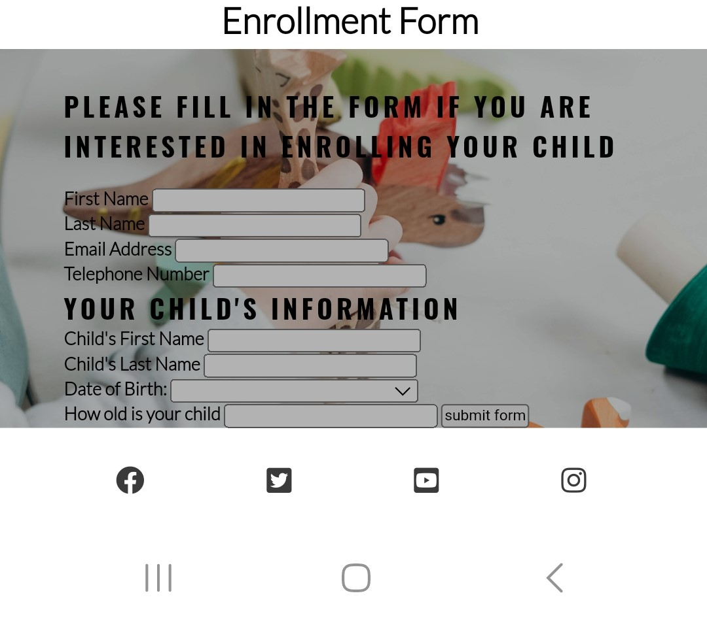
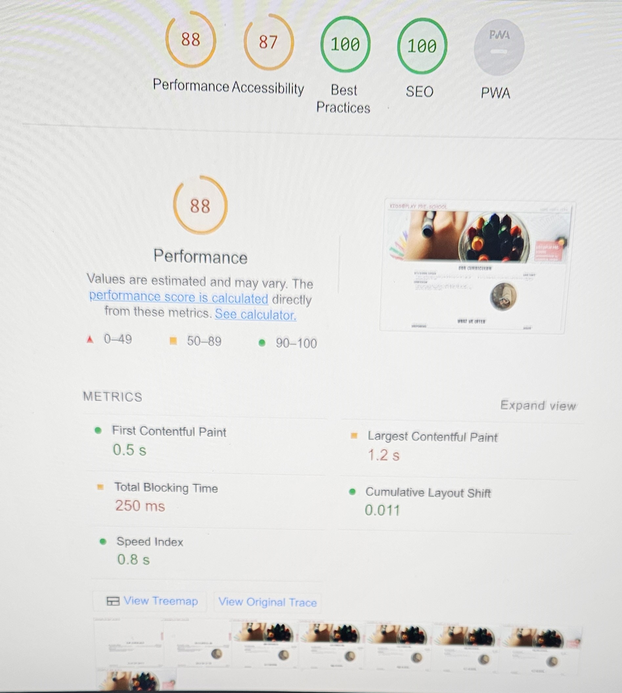

# KIDS @ PLAY

# Welcome to my first ever website.

####    This website is a mock website of a Pre-School.
#### The target consumer for this website are parents who have children ages 6 months to 4years old.
#### The uniqueness of this website is that it caters to those parents who would like to enroll their child in a Global Mindedness.
#### Where each child is heard and each culture is appreciated. Their children will also have a chance to explore outdoors and indoor activities.

##       ScreenShot for Mobile page

 

##        Screen Shot for Tablet

##        Screenshot for desktop

# Features

#### The website target consumers are parents with young children living near the area where their mind-set is about raising their child in a Globel Set UP.
#### The webpage is a one page website where in they can easily scroll down to see what the school have to offer.
#### It is also laid out in a simple way for parents to see easily what the school have to offer

# Navigation Bar

#### There is three navigation bar on the right side of the webpage wherein if you click will scroll down to the site they want to be.
#### It has Three  Navigation bar namely:

    Home: where you will see the name of the school and the picture
    Media: Where they will see the pictures of the activities the school has done
    Form: A responsive form where the reader can fill up a mock form and submit it.

 # Landing page Image

#### The landing page has a photograph of a crayon as a background and the Name of the school and its address. To easily know the name and location of the place.

##  Picture of the Header thru Mobile

 # Curriculum

#### The curriculum contains text about the goals of the school. The text is in color black and is using a font: *insert font here* for easy reading. 
#### It also has a picture of a child gathering rocks to emphasise how we work in the school

#### Background of this area is all white to make sure that the black text is very visible to the eye

## PICTURE OF CURRICULUM PAGE THRU MOBILE

 # What We Offer

#### This area contains text about the daily activities of the school. The text is in color black and is using a font: *insert font here* for easy reading. 
#### It also has a picture of a child with a colorful had to emphasise the activities the school does.
#### Background of this area is all white to make sure that the black text is very visible to the eye.

## PICTURE OF WHAT WE OFFER THRU MOBILE

 # Information

#### The information has a background of children playing. While the text is in bold form and in color white. 
#### This is to ensure that the text is still very visible to the reader and it is not too bright. 

#### The area contains the following

            Address: where the school is located
            Contact Information fo the Principal
            Contact information of the School Administrator
            Opening hours of the school.

## Picture of Information thru mobile

            
#  Gallery

#### The gallery contains Photos of the activities done in the school. The photos chosen are bright and colorful to attract the attention of the reader.
#### It is also placed in a way that the Photos will not over crowd the space. Hence the column spacing of *insert the measurement* was made to ensure that the reader will not be 

#### overwhelmed by the pictures

    

 # Form

#### In the form the reader can see the enrollment form if they can input their details.
#### It has a background picture of a hand with a toy dinosaur and the color of the text is black
#### The background picture's brightness has been muted down to make sure that the text can still be visible and easy to read.

#### The following details are in the form

        First Name
        Last Name
        Email
        Telephone Number
        Child's First Name
        Chld's Last Name
        Age
#### This form is a responsive form where in you can send the form once the details are filled properly

##     Picture of Form and Footer

 # Footer

#### The footer has the following links to social media. It is also a responsive botton, clicking the botton will send you to another page.

#### We used the icons of the social media instead of their names to save space

 # TESTING
 

#### Validator Testing and Unfix Bug
         
w3c html validator

        I have encountered so many errors in my Html codes.
        Here are some of the following errors that I made
          1. I have made either an additional symbols that my code does not need.
          2. My code did not run properly for I wrote the wrong symbol or that I forgot to add a symbol in my code. Like for example a . in the begining of my img code.
          3. I have duplicate my attributes to the code.
          4. The validator can see and end tag but could not see my open tag
          5. My element name could not be named as a child element
          6. A section lacks a heading.
Most of this I have solve but some I have encountered I have still to solve. 
The following problems I have yet to solve:

          No.4. I believe my open tag is too far away from the closing tag that is why the validator can not find it. 
          No. 5 The element is part of the form code and the other codes worked properly only for one part.

          
          
        

         
W3C Css validator

        I used w3c css validator for my code and I got one error, The error was that only a 0 can have not unit.
        If my code has a number it should have a unit.

        Problem not solve since the code I am using here are the following
        flex: 1;
        order: 1;
        column-count: 1;

    If I have more time and been able to research more I would have made more corrections to the mistake I have made in my code.
     

##      Lighthouse Accessability Result

 

 # Deployment

     I have been using codeanywhere as my IDE and had been writting my code there. I then used Github as my repository to deploy my Project.
     

#  Credits

##     Content

#### The content of the Index.Html and Style.css was patterned from the Love Running Project of the Code Institute.
        The link for this is https://code-institute-org.github.io/love-running-2.0/index.html
####    Some content were also copied from the website W3School.com
####    The fonts were taken from fonts.google.com
    To make my forms responsive I used the site <https://formdump.codeinstitute.net/> to be able to create a mock up submission
        

##     Media
#### The Icons from the Footer were take from fontawesome.com
#### For the pictures in the background and Gallery they were all downloaded from pexel.com
    
     

